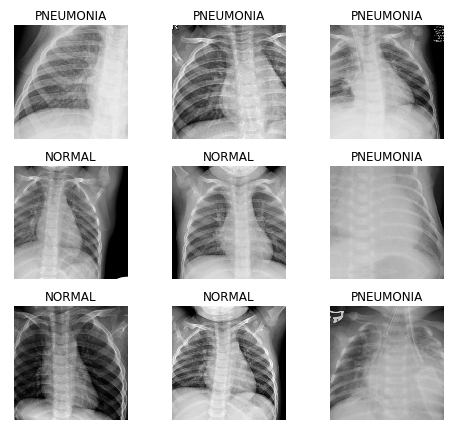
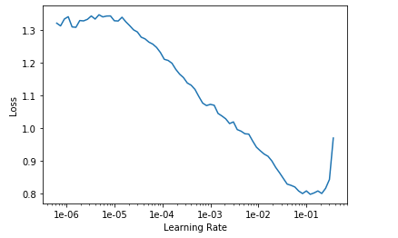
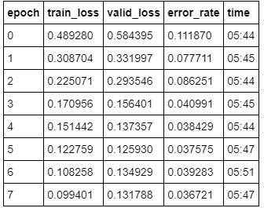

Transfer learning was stated by Andrew Ng in his NIPS 2016 tutorial to be a key driver in the success of industrial applications. It can be shown that even in the handling of medical imaging data, that transfer learning can greatly reduce the costs of training over a dataset compared to the costs of training the same model from scratch. We will load up a simple usage given by Jeremy Howard of fast.ai, of the resnet-50 architecture, trained over the imagenet dataset. This model therefore has a, if you will, a sense of what the material world looks like. The pneumonia dataset we will be using is the kaggle dataset paultimothymooney/chest-xray-pneumonia. 

```python
data.show_batch(rows=3, figsize=(7,6))
```



This dataset is a collection of thousands of labeled files of  chest x-rays. 

```python
learn = cnn_learner(data, models.resnet50, metrics=error_rate)
learn.lr_find()
learn.recorder.plot()
```


Here we use a method that was originally published in the 2015 paper [Cyclical Learning Rates for Training Neural Networks](http://arxiv.org/abs/1506.01186). By simply increasing the learning rate incrementally from a small value and only stopping once the loss started decreasing, you can plot the learning rates. By doing this, one can find the optimal learning rate amongst the plot. 

```python
learn.fit_one_cycle(8)
```



Implementing a method of tuning weights for the network, cycling over our data 8 epochs times, we get an error rate of 0.036721, which means our model is over 96% accurate! Not bad! Note that this was done without unfreezing the model and actually applying the learning rate for minimal loss. The default learning rate of 0.003 of the fit\_one\_cycle method gives appreciable results for this use case, while maintaining a steady lowering of the error rate through each cycling of the data.

You can play around with this experimentation with the [google colab file](https://github.com/ayanrafique/FastAiFun/blob/master/Pneumonia_detection.ipynb). You must download and upload your own kaggle.json file to use the code as is, which can be aquired after making a kaggle account.
